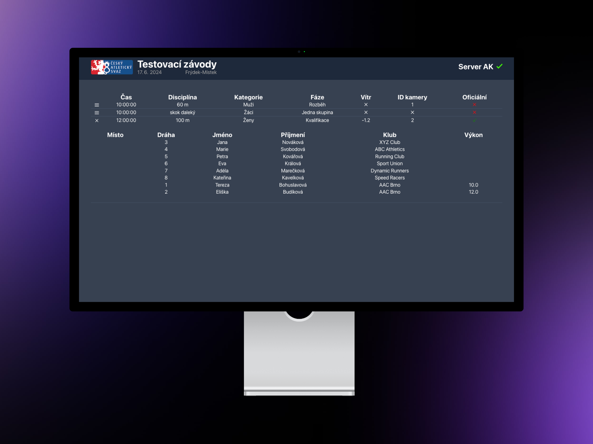

# React App for Athletic Office 2 (AK2) Results

This React application is built to display results from Athletic Office 2 (AK2) using Express.js as the backend.

## Configuration:

Before running the application, make sure to set up the following configurations:

### Environment Variables:

Ensure you edit `.env` file in the root directory of the project with the following variables:

```js
REACT_APP_LOCAL_URL="<URL OF EXPRESS SERVER E.G. : HTTP://192.168.0.2:4000>"
AK_URL="<URL OF ATHLETIC OFFICE E.G. : HTTP://192.168.0.2:3000>" 
```


## Running the Application:

1. **Express.js Backend**:
    - Ensure you have Node.js and Express.js installed.
    - Navigate to the `express` directory.
    - Install dependencies: `npm install`.
    - Start the Express.js server: `node index.js`.
    - The server will run on port 4000 by default.
    - Url is exposed to local network by default

2. **React Frontend**:
    - Navigate to the root directory of the project.
    - Install dependencies: `npm install`.
    - Start the React development server: `npm start`.
    - Access the application in your browser at the specified URL.

## Usage:

Once the application is running, users can access the Athletic Office 2 (AK2) results using their API through the provided interface.

## Technologies Used:

- React.js
- Express.js
- Tailwind CSS
- HTML


## Contributors:
- Jakub Holub

## License:

This project is licensed under the MIT License. See the [LICENSE](LICENSE) file for details.
